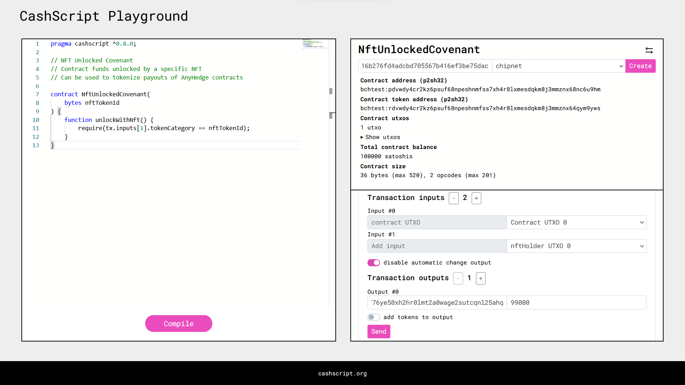
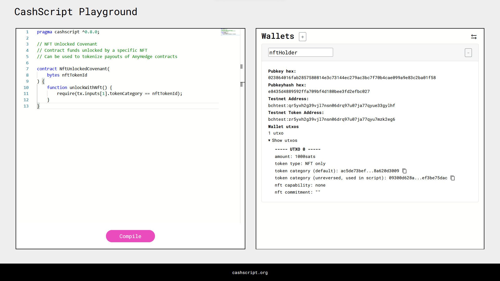
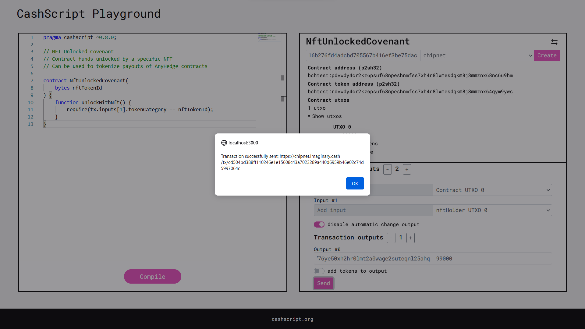

# CashScript Playground
The CashScript Playground is a way to write CashScript contracts and immediately interact with them in the browser. It is inspired by Ethereum's Remix, but slightly less feature-rich.

In the left panel you can write CashScript contracts and compile them. After compiling, a form is generated to create a new instance of this CashScript contract. It will then display some information about the contract and generate new forms to call contract functions to send BCH transactions. Press the arrow buttons to switch to a wallet view where you can generate wallets for testing purposes.

A live demo is available at [playground.cashscript.org](https://playground.cashscript.org/).

## Limitations
Special transaction options such as OP_RETURN, hardcoded fees or relative timelocks are not supported by the playground.

The CashScript-Playground is connected to the Bitcoin Cash chipnet by default, you can get testnet coins from the [testnet faucet](https://tbch.googol.cash/). You can also connect the playground to mainnet but be sure **never to send large amounts** of money to contracts or wallets generated by the CashScript Playground!

## Example






## Running locally
```
git clone git@github.com:CashScript/cashscript-playground.git
cd cashscript-playground
yarn
yarn dev
```

Open [http://localhost:3000](http://localhost:3000) with your browser to see the result.
