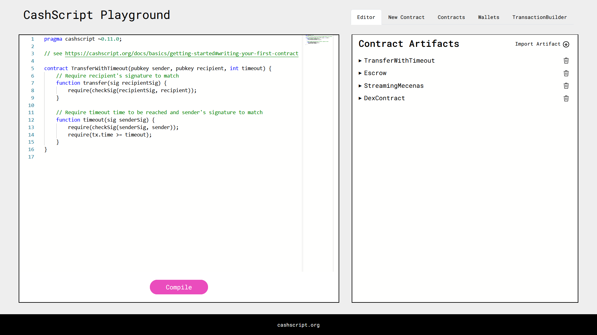
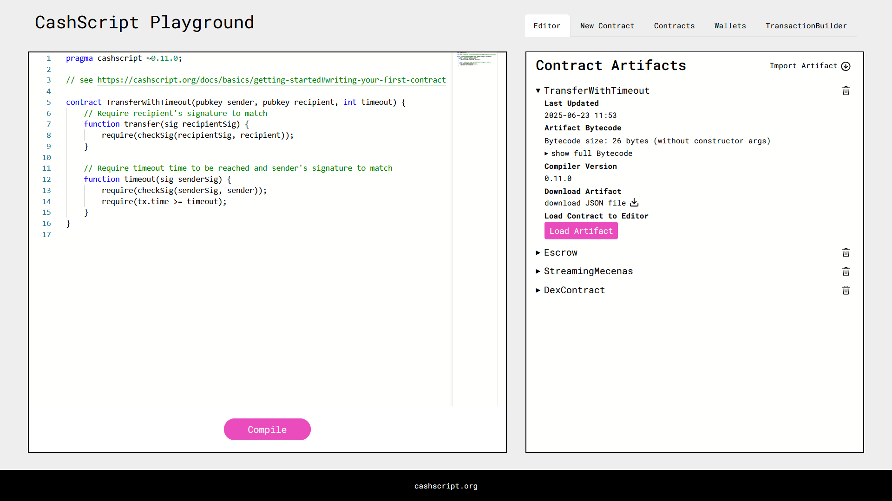
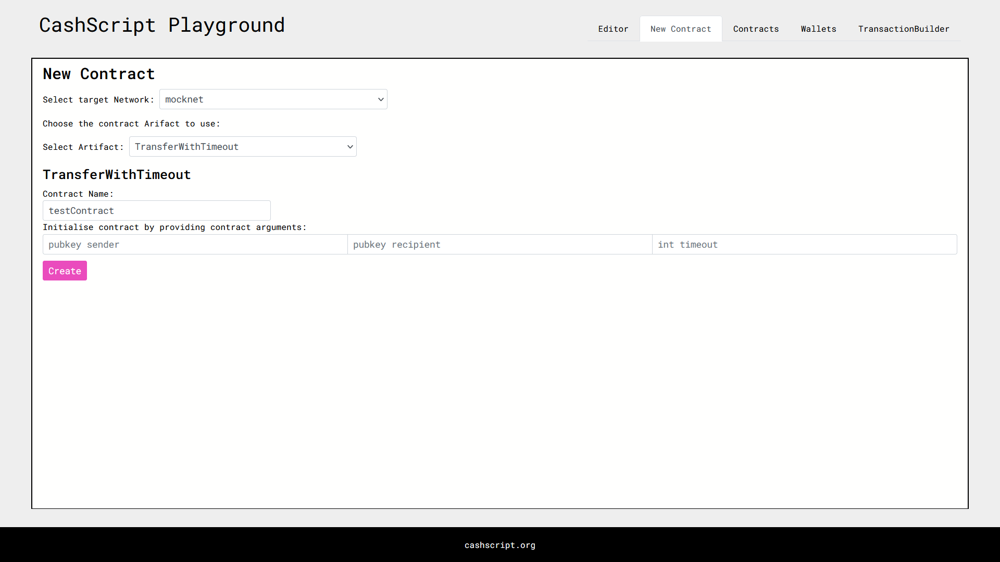

# CashScript Playground
The CashScript Playground is an online IDE for writing CashScript smart contracts and immediately interact with them in the browser. The playground the easiest way to quickly get started with CashScript without any setup. The CashScript playground is inspired by Ethereum's Remix.

The CashScript Playground is available at [playground.cashscript.org](https://playground.cashscript.org/).



In the left panel you can write CashScript contracts and compile them. After compiling, a contract Artifact is generated which can then be used to initialise an instance of the contract, with specific contract arguments.

## Features

The CashScript Playground allows for importing or exporting contract Artifacts and makes it easy to test new versions of your CashScript code. Similarly, it's also easy to create many contract instances of the same contract with different contract arguments. The created Artifacts and contracts are remembered between sessions. 

On the 'Wallets' tab, new key-pairs for testing wallets can be generated with just a mouse click. Each with detailed info on about the key pair and its network balance, with a full list of all current UTXOs. Lastly the TransactionBuilder supports CashTokens, manual input selection for easy P2PK inputs and signing selection through a simple dropdown! 

## Limitations

The playground uses the 'Simple transactio builder' so it doesn't support combining multiple different smart contracts in one transaction.

Special transaction options such as OP_RETURN or relative timelocks are also not supported by the playground.

## Disclaimer

The CashScript-Playground is connected to the Bitcoin Cash chipnet by default, you can get testnet coins from the [testnet faucet](https://tbch.googol.cash/). You can also connect the playground to mainnet but be sure **never to send large amounts** of money to contracts or wallets generated by the CashScript Playground!

## ScreenShots




## Running locally
```
git clone git@github.com:CashScript/cashscript-playground.git
cd cashscript-playground
yarn
yarn dev
```

Open [http://localhost:3000](http://localhost:3000) with your browser to see the result.
